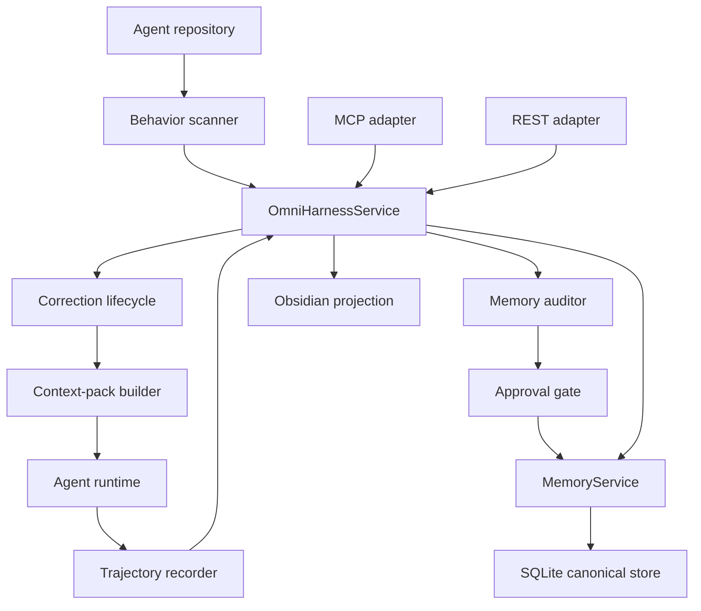
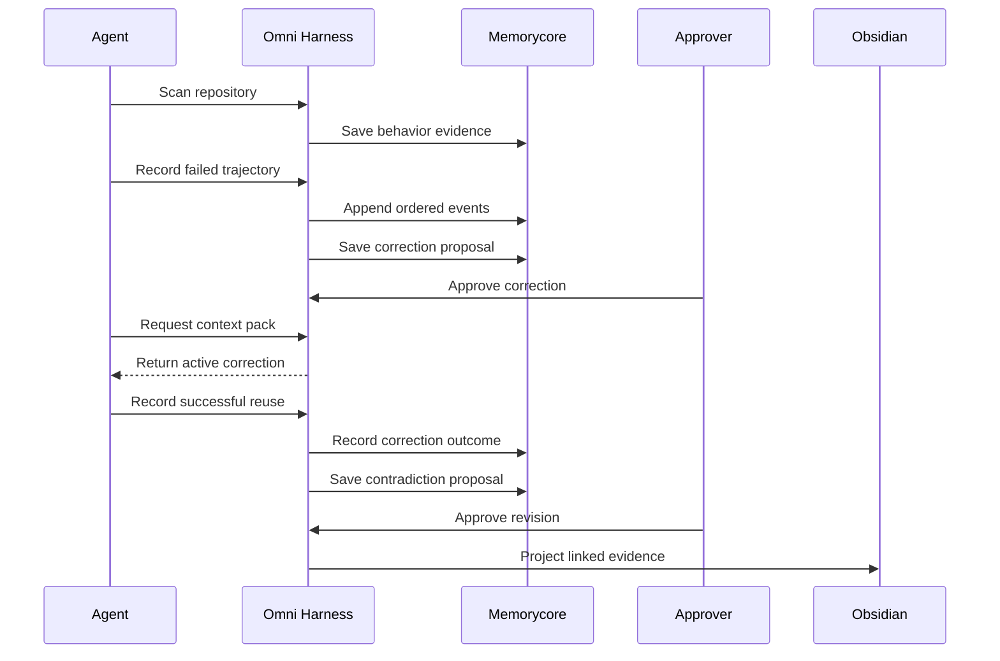
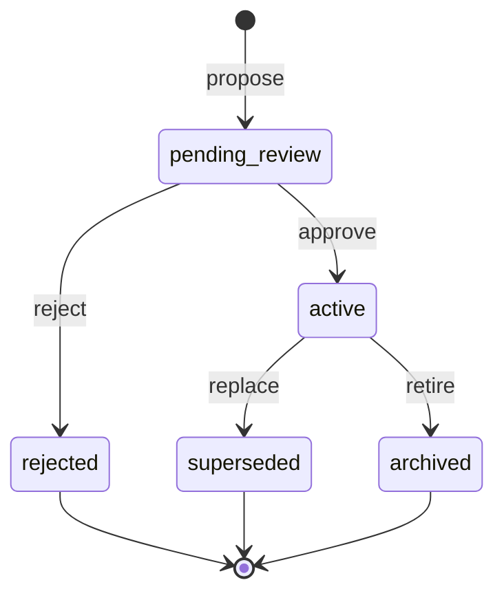

# Omni Memory Harness — Implementation Architecture

This document is the execution map for a human or coding LLM working on the
Omni Memory Harness inside Memorycore. It describes the target architecture,
the order in which work must be performed, the files each step owns, and the
evidence required before a step is complete.

## 1. Mission and boundaries

**Mission:** help an agent connect behavior to source code, record what it did,
learn a governed correction from failure, retrieve that correction before a
similar task, audit contradictory memories, and show the complete history in
Obsidian-compatible Markdown.

**Canonical source:** Memorycore storage accessed through `MemoryService` and
`OmniHarnessService`.

**Projection only:** generated Obsidian Markdown is readable evidence, not a
database and not an input that mutates canonical records.

**Repository baseline:**

```yaml
repository: Carlosdanger96/Memorycore
branch: hackathon/omni-memory-harness
baseline_commit: cd42c5e5c61c2e38913db557fd310aae1f41eeca
implementation_start_commit: 7e36f2a6d54024303b9f67933c834d395c5790a9
baseline_tag: hackathon-baseline-2026-07-19
baseline_tag_remote_status: pending_push
```

### Non-negotiable invariants

1. Adapters never access SQLite directly.
2. Scanning is read-only, allowlisted, and never executes repository code.
3. Trajectory events and governance events are append-only.
4. Secrets are redacted before persistence, logging, projection, or provider calls.
5. Model output creates proposals; it never silently changes canonical memory.
6. Canonical correction activation and memory revision require an approver.
7. Every operation is project-scoped and every write has an authenticated actor.
8. REST binds to loopback by default and requires a bearer token.
9. Deterministic providers keep tests and the demo usable without network access.
10. Existing Memorycore behavior remains backward compatible.

## 2. System topology



### Ownership map

| Layer | Owns | Must not own | Primary files |
| --- | --- | --- | --- |
| Memorycore | Canonical memory lifecycle, auth policy, storage | Agent-specific UI | `memory_service.py`, `database.py` |
| Behavior registry | Source-to-behavior evidence | Code execution | `behavior/scanner.py` |
| Experience layer | Trajectories, signatures, corrections, ranking | Canonical memory rewrites | `omni_service.py`, `experience/providers.py` |
| Audit layer | Findings and revision proposals | Automatic approval | `audit/providers.py`, `omni_service.py` |
| Interfaces | Authenticated transport and role enforcement | SQL and business rules | `mcp_server.py`, `api/omni_routes.py` |
| Projection | Stable human-readable Markdown | Canonical state | `projections/obsidian.py` |
| Demo/evidence | Reproducible proof | Production data | `demo/`, `scripts/` |

## 3. End-to-end runtime loop

The vertical slice is complete only when this sequence succeeds:



Required demo proof:

```text
source behavior found
  -> first execution fails
  -> correction is proposed and approved
  -> correction is retrieved before the second execution
  -> second execution applies it and succeeds
  -> reuse outcome updates correction evidence
  -> contradiction is proposed, reviewed, and approved
  -> originals and immutable events remain inspectable
  -> Markdown projection links the complete chain
```

## 4. Status vocabulary

Use these labels in implementation notes and pull-request descriptions:

| Label | Meaning |
| --- | --- |
| `DONE` | Implemented on the current branch and covered by a passing test |
| `HARDEN` | Present, but missing a required security, correctness, or evidence property |
| `TODO` | Required for the intended completion gate and not implemented |
| `DEFER` | Explicitly outside the hackathon vertical slice |

### Roadmap at a glance

| Step | Workstream | State | Primary remaining result |
| ---: | --- | --- | --- |
| 0 | Baseline and branch | `TODO` | Push the baseline tag |
| 1 | Domain contracts | `DONE` | None |
| 2 | Persistence | `DONE` | Migration 4 and correction events implemented |
| 3 | Behavior registry | `DONE` | Ignore rules and symlink confinement tested |
| 4 | Trajectories | `DONE` | Referential and terminal-state validation tested |
| 5 | Correction lifecycle | `DONE` | Immutable proposal and approval events implemented |
| 6 | Retrieval/context | `DONE` | Ranking uses verified reuse outcomes |
| 7 | Correction outcomes | `DONE` | Transactional outcome ledger and counters implemented |
| 8 | Memory auditing | `DONE` | Provider payload minimization and redaction tested |
| 9 | MCP and REST | `DONE` | Outcome endpoint/tool and schema parity implemented |
| 10 | Obsidian | `DONE` | Reuse metric and successful-run links implemented |
| 11 | Demo | `DONE` | Clean Linux and hosted Windows paths passed |
| 12 | CI/security | `DONE` | All six hosted jobs passed in run `29700494661` |
| 13 | Evidence/PR | `TODO` | Remote evidence, feedback ID, and draft PR |

## 5. Ordered implementation plan

Do not reorder steps unless every dependency named by the step is already
satisfied. After each step, run its focused tests before moving forward.

### Step 0 — Protect the baseline and working branch

**Status:** `DONE`, except the remote baseline tag is `TODO`.

**Objective:** preserve a defensible before/after comparison and prevent runtime
files or credentials from entering Git history.

**Actions:**

1. Confirm the branch starts at the recorded baseline.
2. Keep all implementation on `hackathon/omni-memory-harness`.
3. Confirm `.env`, databases, generated vaults, evidence exports, and caches are ignored.
4. Push the annotated baseline tag to the remote.
5. Never merge PR #9 blindly; port only compatible concepts.
6. Keep PR #10 out of this submission because it contains unrelated dependency updates.

**Commands:**

```bash
git status --short --branch
git diff --stat cd42c5e5c61c2e38913db557fd310aae1f41eeca...HEAD
git check-ignore -v .env
git push origin hackathon-baseline-2026-07-19
```

**Completion gate:** branch diff contains only submission work, forbidden runtime
files are absent, and the remote tag resolves to the baseline commit.

### Step 1 — Establish domain contracts

**Status:** `DONE`.

**Objective:** define stable typed records before transport or provider code.

**Files:**

- `src/memorycore/omni_models.py`
- `src/memorycore/models.py`

**Actions:**

1. Define `BehaviorRecord`, `Trajectory`, `TrajectoryEvent`,
   `ExperienceCorrection`, and `AuditFinding`.
2. Bound correction operations to six values:
   `add_step`, `replace_step`, `change_tool`, `expand_search`,
   `require_verification`, and `escalate_approval`.
3. Bound event and finding types with enums.
4. Reject unsupported values at the service boundary.
5. Keep records JSON-serializable and provider-neutral.

**Completion gate:** invalid operations, event types, and finding types fail
deterministically before persistence.

### Step 2 — Add canonical persistence and migrations

**Status:** `DONE`; migration 3 remains intact and migration 4 adds correction events.

**Objective:** persist Omni records without replacing existing memory storage.

**Files:**

- `src/memorycore/database.py`
- `migrations/003_omni_memory_harness.sql`
- new `migrations/004_correction_outcome_events.sql`

**Existing tables:**

| Table | Purpose | Mutation rule |
| --- | --- | --- |
| `omni_records` | Materialized behavior, trajectory, correction, and finding state | Service-controlled upsert |
| `omni_trajectory_events` | Ordered runtime evidence | Append-only |
| `omni_revision_events` | Memory revision decisions | Append-only |
| `memories` | Canonical governed memories | Existing lifecycle rules |
| `memory_events` | Canonical memory history | Append-only |

**Required migration 4:**

```sql
CREATE TABLE omni_correction_events (
    event_id TEXT PRIMARY KEY,
    correction_id TEXT NOT NULL,
    trajectory_id TEXT,
    event_type TEXT NOT NULL,
    outcome TEXT,
    evidence_event_id TEXT,
    actor TEXT,
    request_id TEXT,
    details TEXT NOT NULL DEFAULT '{}',
    created_at TEXT NOT NULL,
    UNIQUE(correction_id, request_id)
);
```

Allowed correction event types should include `proposed`, `approved`, `applied`,
`succeeded`, `failed`, `partial`, `rejected`, and `superseded`.

**Required methods:**

```python
add_omni_correction_event(event: dict) -> tuple[dict, bool]
list_omni_correction_events(correction_id: str) -> list[dict]
```

**Completion gate:** migration upgrade, restart persistence, backup/restore, and
request-id idempotency tests pass on both a new and a version-3 database.

### Step 3 — Build the behavior registry

**Status:** `DONE`; ignore-file rules, negation, and symlink confinement are tested.

**Objective:** create deterministic behavior-to-code evidence without running
scanned code.

**Files:**

- `src/memorycore/behavior/scanner.py`
- `tests/test_omni_scanner.py`

**Implemented actions:**

1. Resolve repository paths and enforce explicit allowed roots.
2. Parse Python with `ast`; never import target modules.
3. Extract conservative TypeScript exports, functions, classes, and imports.
4. Discover JSON, YAML, TOML, and environment-template config files.
5. Link tests that mention discovered symbols.
6. Capture the Git revision.
7. Skip common build, cache, virtual-environment, database, and secret paths.
8. Mark prior behavior records stale after revision changes.

**Hardening actions:**

1. Parse and honor repository `.gitignore` rules, including nested rules and negation.
2. Add an optional explicit scanner ignore file for deployment policy.
3. Test ignored directories, ignored files, negated rules, symlinks, and oversized files.
4. Verify the scanner never follows a symlink outside the allowed root.
5. Keep GPT-assisted naming optional; raw findings remain deterministic evidence.

**Completion gate:** two scans of unchanged code produce no duplicates; a revision
change stales obsolete records; ignored or secret content is never read or returned.

### Step 4 — Capture append-only trajectories

**Status:** `DONE`; referential and terminal-state validation are implemented.

**Objective:** reconstruct exactly what the agent did without storing secrets.

**Files:**

- `src/memorycore/omni_service.py`
- `src/memorycore/database.py`
- `tests/test_omni_experience.py`

**Actions:**

1. Create a trajectory with project, task, agent, repository, and revision identity.
2. Append events with strictly increasing sequence numbers.
3. Return the existing event for a repeated request ID.
4. Redact inputs, outputs, metadata, and provenance recursively.
5. Enforce event-size limits.
6. Generate deterministic error signatures from normalized fields.
7. Materialize completion state when `task_completed` or `task_failed` is appended.
8. Reconstruct a trajectory by returning its materialized record plus ordered events.
9. Validate referenced behavior, memory, correction, and parent-event IDs in the same project.
10. Reject events after a terminal event unless an explicit reopening design is approved.

**Completion gate:** sequence, idempotency, redaction, terminal-state, reference,
restart, and concurrent-write tests pass.

### Step 5 — Extract and approve experience corrections

**Status:** `DONE`; proposal, approval, application, and outcome events are immutable.

**Objective:** turn failure evidence into a bounded, operational, reviewable rule.

**Files:**

- `src/memorycore/experience/providers.py`
- `src/memorycore/omni_service.py`
- `src/memorycore/omni_models.py`

**Actions:**

1. Accept a failed trajectory and optional successful comparison.
2. Use a deterministic provider offline or an OpenAI Responses API provider when enabled.
3. Require strict structured output and one of the six supported operations.
4. Require provider-cited evidence event IDs and validate them against the trajectory.
5. Store model, prompt version, confidence, trigger, and evidence provenance.
6. Start live proposals in `pending_review`.
7. Allow only an approver or administrator to activate a proposal.
8. Append immutable `proposed` and `approved` correction events.
9. Preserve superseded or rejected corrections instead of deleting them.

**State machine:**



**Completion gate:** malformed provider output and unknown evidence fail; an
unauthorized actor cannot activate; every state change has an immutable event.

### Step 6 — Retrieve corrections and build context packs

**Status:** `DONE`; deterministic ranking includes verified reuse accounting.

**Objective:** supply only applicable governed memory and active corrections
before an agent acts.

**Files:**

- `src/memorycore/omni_service.py`
- `src/memorycore/retrieval.py`
- `tests/test_omni_experience.py`

**Ranking inputs:**

```text
exact error signature
+ exact task type
+ behavior overlap
+ repository match
+ tool match
+ confidence
+ verified reuse success rate
+ recency
- staleness
- contradiction
```

**Actions:**

1. Search only active, authorized, non-superseded corrections.
2. Produce a stable score and deterministic tie-breaker.
3. Return `why_matched`, supporting evidence, applicable behaviors, and limitations.
4. Combine corrections with governed active memory in one context pack.
5. Keep the complete correction object separate from rendered `context_text`.
6. Bound query length, result count, and context size.
7. Exclude corrections contradicted by an unresolved governed finding.

**Completion gate:** identical input produces identical ordering; cross-project and
inactive records never appear; a successful reuse increases future ranking only
after outcome evidence is recorded.

### Step 7 — Record correction application and outcome

**Status:** `DONE`; evidence-backed outcomes update counters transactionally and idempotently.

**Objective:** prove whether a retrieved correction helped instead of displaying
counters that never change.

**Files:**

- `src/memorycore/omni_models.py`
- `src/memorycore/database.py`
- `src/memorycore/omni_service.py`
- `src/memorycore/mcp_server.py`
- `src/memorycore/api/omni_routes.py`
- `src/memorycore/projections/obsidian.py`
- new focused tests

**Service contract:**

```python
record_correction_outcome(
    correction_id: str,
    trajectory_id: str,
    outcome: Literal["succeeded", "failed", "partial"],
    evidence_event_id: str,
    actor: str,
    request_id: str,
    details: dict | None = None,
) -> dict
```

**Validation order:**

1. Correction exists, is active, and belongs to the actor's allowed project.
2. Trajectory exists in the same project and repository scope.
3. Trajectory contains a `correction_applied` event referencing the correction.
4. `evidence_event_id` exists on that trajectory.
5. Success requires a terminal `task_completed` event; failure requires `task_failed`.
6. Repeated `request_id` returns the existing outcome without changing counters.
7. Append the outcome event and update the materialized counters in one transaction.

**Counter rules:**

| Outcome | `use_count` | `success_count` | `failure_count` | Successful trajectory link |
| --- | ---: | ---: | ---: | --- |
| `succeeded` | +1 | +1 | +0 | Add once |
| `failed` | +1 | +0 | +1 | Do not add |
| `partial` | +1 | +0 | +0 | Do not add; retain event detail |

**New interfaces:**

```text
MCP:  omni_record_correction_outcome
REST: POST /v1/omni/corrections/{correction_id}/outcomes
Role: writer, approver, or administrator
```

**Completion gate:** counters and evidence survive restart, duplicate requests do
not double count, and the dashboard reports a real reuse ratio with links.

### Step 8 — Audit memories and govern revisions

**Status:** `DONE`; deterministic/live paths and provider input sanitization are tested.

**Objective:** identify conflicts and propose revisions while preserving originals.

**Files:**

- `src/memorycore/audit/providers.py`
- `src/memorycore/omni_service.py`
- `tests/test_omni_audit_provider.py`
- `tests/test_omni_audit_projection.py`

**Actions:**

1. Search relevant active memories in one project.
2. Run a deterministic offline provider or the configured live provider.
3. Require strict structured `AuditFinding` output.
4. Validate every referenced memory and correction ID.
5. Save a pending finding and proposed replacement; do not mutate canonical memory.
6. Require approver authorization for the revision.
7. Supersede or archive through `MemoryService` only.
8. Preserve original memory records and append revision events.

**Critical hardening before live use:**

1. Apply the shared recursive `redact()` function before constructing provider payloads.
2. Remove `source_uri` by default or allow only approved URI schemes and hosts.
3. Allowlist metadata keys; never forward arbitrary metadata.
4. Bound every string and the total serialized request size.
5. Exclude credentials, session tokens, environment values, and private local paths.
6. Add tests that intercept the outgoing request and assert forbidden values are absent.

**OpenAI provider contract:**

```yaml
api: Responses API
store: false
output: strict JSON schema
default_model: gpt-5.6
model_override: environment variable
offline_fallback: deterministic provider
canonical_mutation: forbidden without separate human approval
```

**Completion gate:** a live-provider request contains only allowlisted redacted
fields; approval preserves originals and records reviewer, model, prompt version,
evidence, and timestamps.

### Step 9 — Expose one service through MCP and REST

**Status:** `DONE`; correction outcomes are exposed through MCP and REST.

**Objective:** expose identical rules through both protocols without duplicating
business logic.

**Files:**

- `src/memorycore/mcp_server.py`
- `src/memorycore/api/omni_routes.py`
- `src/memorycore/http_auth.py`
- `tests/test_omni_interfaces.py`

**Request path:**

```text
Bearer identity
  -> role check
  -> project allowlist
  -> input and content limits
  -> OmniHarnessService / MemoryService
  -> redacted result
  -> request ID and structured response
```

**Role matrix:**

| Operation | Reader | Writer | Approver | Admin |
| --- | :---: | :---: | :---: | :---: |
| Health/search/get/context | yes | yes | yes | yes |
| Scan repository | no | yes | yes | yes |
| Create trajectory/append event | no | yes | yes | yes |
| Propose/extract correction | no | yes | yes | yes |
| Approve correction | no | no | yes | yes |
| Record correction outcome | no | yes | yes | yes |
| Run audit | no | yes | yes | yes |
| Approve memory revision | no | no | yes | yes |
| Project Obsidian | no | yes | yes | yes |

**Actions:**

1. Keep reads available to readers and all writes role-gated.
2. Enforce project scope on get-by-ID operations, not just list operations.
3. Require request IDs on state-changing writes or generate and return one.
4. Keep request and result limits consistent across MCP and REST.
5. Generate OpenAPI and MCP schemas from shared definitions where practical.
6. Add parity tests for role, validation, error, and result semantics.
7. Bind REST to `127.0.0.1` or another loopback address only.
8. Keep CORS disabled unless a separate authenticated deployment design requires it.

**Completion gate:** missing/invalid tokens fail, cross-project access fails, readers
cannot write, and equivalent MCP/REST calls return equivalent domain results.

### Step 10 — Project human-readable Obsidian evidence

**Status:** `DONE`; correction outcome links, lifecycle events, and reuse metrics are projected.

**Objective:** make canonical records inspectable without making Markdown canonical.

**Files:**

- `src/memorycore/projections/obsidian.py`
- `tests/test_omni_audit_projection.py`

**Required tree:**

```text
90_LLM_Exchange/Omni Memory Harness/
├── Dashboard.md
├── Behaviors/
├── Trajectories/
├── Corrections/
│   ├── Inbox/
│   ├── Active/
│   ├── Rejected/
│   └── Archived/
├── Conflicts/
├── Decisions/
└── Provenance/
```

**Actions:**

1. Use stable filenames and deterministic ordering.
2. Add frontmatter with record type, ID, canonical source, repository, revision,
   status, confidence, and generation timestamp.
3. State visibly that editing Markdown does not mutate Memorycore.
4. Link behaviors to source, trajectories to behaviors, corrections to failed
   evidence, correction outcomes to successful reuse, conflicts to memories, and
   decisions to approval events.
5. Report behavior, trajectory, correction, reuse, conflict, and repository counts.
6. Avoid rewriting an unchanged file.

**Completion gate:** a second projection performs zero writes and all required links
resolve inside the generated tree.

### Step 11 — Run the isolated synthetic demonstration

**Status:** `DONE`; scenario, clean setup, Linux execution, and hosted Windows execution passed.

**Objective:** prove the product loop without external accounts or production data.

**Files:**

- `demo/synthetic-agent/`
- `src/memorycore/demo/runner.py`
- `scripts/demo.sh`
- `scripts/demo.ps1`
- `scripts/verify_demo.py`
- `DEMO_SCRIPT.md`

**Actions:**

1. Create a temporary database and temporary vault.
2. Initialize an isolated environment from a clean checkout.
3. Install the package and focused test dependencies.
4. Run migrations.
5. Scan the synthetic repository.
6. Execute and record the deliberate verification failure.
7. Extract and approve `require_verification`.
8. Retrieve it in a second context pack before execution.
9. Record correction application, successful completion, and outcome evidence.
10. Seed contradictory memories, audit them, and approve the proposal.
11. Generate and verify the Markdown projection.
12. Run focused tests and startup checks.
13. Print IDs, output paths, and exact REST/MCP startup commands.
14. Exit nonzero when any proof is missing.

**Hardening actions:**

1. Make both scripts create/reuse `.venv` safely instead of depending on `PYTHONPATH`.
2. Test the PowerShell script on real Windows.
3. Ensure repeated runs never touch the user's default database or vault.
4. Add `--live` as an explicit opt-in; offline remains the default.

**Completion gate:** both platform entrypoints pass from a clean clone with no API
key and no preinstalled editable package.

### Step 12 — Add CI and security regression checks

**Status:** `DONE`; all six jobs passed in hosted workflow run `29700494661`.

**Objective:** make the proof repeatable by reviewers rather than dependent on one
developer machine.

**Files:**

- new `.github/workflows/omni-harness.yml`
- test and script updates as required

**Required CI jobs:**

| Job | Platform | Required checks |
| --- | --- | --- |
| Python | Ubuntu | 3.11, 3.12, 3.13; compile and full tests |
| Offline demo | Ubuntu | one-command demo and evidence verification |
| Windows smoke | Windows | `scripts/demo.ps1` and focused tests |
| Security | Ubuntu | secret-pattern scan, ignored-file check, provider-redaction tests |
| Migration | Ubuntu | upgrade from baseline DB fixture and restart |

**Actions:**

1. Pin action major versions and use least-privilege permissions.
2. Never pass the live OpenAI key to pull-request jobs.
3. Upload only sanitized demo/test artifacts.
4. Fail when generated OpenAPI or MCP schemas drift unexpectedly.
5. Keep optional live-provider verification manual or protected.

**Completion gate:** all required jobs pass on the hackathon branch and their logs
contain no secrets or production paths.

### Step 13 — Collect evidence and prepare the draft pull request

**Status:** exporter is `DONE`; final remote evidence is `TODO`.

**Objective:** make every hackathon claim independently verifiable.

**Files:**

- `scripts/export_evidence.py`
- `BEFORE_HACKATHON.md`
- `HACKATHON_CHANGES.md`
- `CODEX_COLLABORATION.md`
- `THIRD_PARTY_NOTICES.md`
- `TESTING.md`
- `DEMO_SCRIPT.md`

**Actions:**

1. Run the full suite and offline demo from a clean checkout.
2. Export branch, baseline, log, test, demo, OpenAPI, MCP, dependency, and license evidence.
3. Keep generated evidence outside the committed repository unless explicitly required.
4. Record a real Codex `/feedback` session ID; never invent one.
5. Capture actual Windows output and screenshots/video for manual submission evidence.
6. Verify the remote branch diff contains no `.env`, database, token, cache, or generated vault.
7. Push the baseline tag.
8. Open a draft PR from `hackathon/omni-memory-harness` to `main`.
9. Document the live GPT-5.6 403 as a project-entitlement limitation, not a code success.

**Completion gate:** a reviewer can reproduce every claim using only the branch,
documented commands, and sanitized evidence package.

## 6. Implementation queue and current state

The work that began from commit `7e36f2a` follows this dependency order. Tasks
T1 through T5 are implemented in the current working tree; T6 still requires
remote CI and manual submission evidence.

```yaml
tasks:
  - id: T1
    title: Correction outcome ledger
    status: completed
    depends_on: []
    touches:
      - src/memorycore/omni_models.py
      - src/memorycore/database.py
      - migrations/004_correction_outcome_events.sql
      - src/memorycore/omni_service.py
      - tests
    done_when:
      - immutable application and outcome events exist
      - counters update transactionally
      - duplicate request IDs do not double count

  - id: T2
    title: Correction outcome MCP, REST, and projection parity
    status: completed
    depends_on: [T1]
    touches:
      - src/memorycore/mcp_server.py
      - src/memorycore/api/omni_routes.py
      - src/memorycore/projections/obsidian.py
      - tests
    done_when:
      - both protocols enforce identical role and project policy
      - dashboard reuse metrics come from recorded outcomes

  - id: T3
    title: Live-provider data minimization
    status: completed
    depends_on: []
    touches:
      - src/memorycore/audit/providers.py
      - src/memorycore/experience/providers.py
      - tests/test_omni_audit_provider.py
    done_when:
      - intercepted requests contain only allowlisted redacted fields
      - source URIs and arbitrary metadata are not forwarded

  - id: T4
    title: Scanner ignore and symlink compliance
    status: completed
    depends_on: []
    touches:
      - src/memorycore/behavior/scanner.py
      - tests/test_omni_scanner.py
    done_when:
      - gitignore rules and negations work
      - paths cannot escape the allowlisted root

  - id: T5
    title: Clean-checkout demo setup
    status: completed
    depends_on: [T1, T2]
    touches:
      - scripts/demo.sh
      - scripts/demo.ps1
      - src/memorycore/demo/runner.py
      - scripts/verify_demo.py
    done_when:
      - Linux and Windows entrypoints install and run without PYTHONPATH
      - successful reuse is visible in output and projection

  - id: T6
    title: CI and release evidence
    status: ci_complete_manual_release_evidence_pending
    depends_on: [T3, T4, T5]
    touches:
      - .github/workflows/omni-harness.yml
      - scripts/export_evidence.py
      - documentation
    done_when:
      - required CI matrix is green
      - remote baseline tag exists
      - sanitized evidence is reproducible
```

## 7. LLM implementation protocol

For each task, the implementing LLM must use this loop:

```text
1. Read this architecture and the files listed by the task.
2. Inspect git status; preserve unrelated user changes.
3. State the task's invariant and acceptance gate.
4. Add or update focused tests first when the desired contract is not obvious.
5. Implement the smallest service-level change.
6. Add adapter/projection changes only after the service contract passes.
7. Run focused tests.
8. Run the full suite.
9. Run the offline demo when runtime behavior changed.
10. Inspect git diff for secrets, generated data, scope creep, and stale docs.
11. Update HACKATHON_CHANGES.md with actual results only.
12. Commit one coherent change; do not bundle unrelated dependency updates.
```

### Required response format for an implementing LLM

```yaml
task: T<number>
outcome: completed | blocked | partially_completed
files_changed: []
contracts_added_or_changed: []
migrations: []
tests_run:
  - command: "..."
    result: "..."
security_checks: []
known_limitations: []
next_task: T<number> | null
```

### Stop conditions

Stop and request human direction if any task would:

- change the baseline or rewrite published Git history;
- merge PR #9 or PR #10 wholesale;
- expose or commit credentials;
- require production data or a real Obsidian vault;
- permit an LLM to approve its own canonical revision;
- add Postgres, Redis, a graph database, Kubernetes, or a frontend framework;
- modify Hermes, Omni Core, OpenClaw, or Mistral Search as part of this slice;
- weaken authentication, role policy, project scoping, or loopback defaults.

## 8. Verification matrix

| Capability | Focused evidence | Full-system evidence |
| --- | --- | --- |
| Behavior registry | AST/TypeScript/config/ignore/revision tests | Synthetic behavior map |
| Trajectory capture | Sequence, idempotency, redaction, references | Failed and successful run reconstruction |
| Correction lifecycle | Schema, evidence, role, event tests | Approved correction in second context pack |
| Correction reuse | Outcome idempotency and counter tests | Dashboard links successful reuse |
| Audit governance | Provider schema/redaction and approval tests | Contradiction revision with originals preserved |
| MCP/REST | Auth, role, project, parity tests | Startup and unauthorized request proof |
| Projection | Stable name/link/idempotency tests | Generated 90_LLM_Exchange tree |
| Recovery | Migration, restart, backup/restore tests | Clean-clone demo rerun |
| Security | Secret, path, size, and allowlist tests | Sanitized CI/evidence logs |

## 9. Definition of done

The architecture is implemented when all of the following are true:

- The baseline tag exists remotely and the branch diff is cleanly attributable.
- Every required model and migration is backward compatible.
- Scanner ignore rules and path confinement are tested.
- Trajectory references, sequence, idempotency, redaction, and terminal state are enforced.
- Correction proposals, approvals, applications, and outcomes have immutable evidence.
- Reuse counters reflect verified outcomes and affect ranking.
- Live OpenAI requests are minimized and redacted before transmission.
- Memory audit proposals never mutate canonical records without an approver.
- MCP and REST enforce the same roles, project scope, limits, and service contracts.
- Obsidian projection is linked, stable, idempotent, and visibly non-canonical.
- The offline demo passes from clean Linux/macOS and Windows checkouts.
- CI, migration, restart, backup, security, and complete test suites pass.
- The evidence exporter reports only real commits, commands, outputs, and session IDs.

## 10. Explicitly deferred work

Do not pull these items into the hackathon completion path:

- Full Omni Core graphical UI.
- Live Hermes modification or real-user trajectory ingestion.
- Autonomous memory approval.
- Cross-device synchronization and production multi-tenancy.
- PostgreSQL parity for Omni records.
- Vector or graph infrastructure.
- General-purpose static analysis for arbitrary languages.
- Mistral Search ownership of canonical lifecycle.
- OpenClaw write access.

The finished product is a reliable governed Memorycore extension with an
Obsidian projection, not a universal agent operating system.
